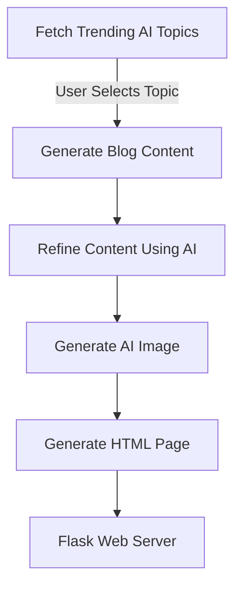

# AI-Driven Content Generation and Publishing

##  Overview
This project is an **AI-powered content generation system** that automates the process of:
1. **Fetching trending AI topics**
2. **Generating high-quality content**
3. **Iteratively refining the article for clarity and coherence**
4. **Creating an AI-generated image**
5. **Rendering the final output as an HTML page**
6. **Hosting it locally using Flask**

The system leverages **LangGraph for workflow orchestration**, **OpenAI’s GPT-4 for content generation**, **DALL·E for image creation**, and **Flask for web hosting**.

---

##  Features
✅ **Fully automated AI-driven content generation**  
✅ **Self-improving blog refinement process**  
✅ **AI-generated images using DALL·E**  
✅ **Structured LangGraph workflow execution**  
✅ **Flask-based local hosting for easy preview**  

---

## 🏗 Architecture Overview
The implementation follows a **step-by-step AI-powered workflow**:


##  Implementation breakdown

# Step 1: Clone the Repository
```git clone https://github.com/your-repo-name/AI-Content-Generator.git
cd AI-Content-Generator
```

# Step 2: Set Up a Virtual Environment (Optional but Recommended)
python -m venv venv
source venv/bin/activate  # On Windows: venv\Scripts\activate

# Step 3: Install Required Dependencies
pip install -r requirements.txt

# Step 4: Set Up API Keys
echo "NVIDAIA_API_LEY=your_nvidia_api_key" > .env

# Step 5: Fetch Trending Topics Using BeautifulSoup (Runs in Python Script)
```python
# Fetch the trending AI topics from Google News
def fetch_topics(keyword="AI NLP", num_articles=10):
    """Fetches trending AI topics from an external source """
    googlenews = GoogleNews(lang='en', region='US', period='2d')
    googlenews.search(keyword)
    results = googlenews.result()[:num_articles]
    return [article['title'] for article in results]

articles = fetch_topics()
```

# Step 6: Select a Topic Manually
echo "Enter the topic number you want to generate content for:"
read topic_choice

# Step 7: Run AI Content Generation with LangChain
```python
def generate_content(messages):
    url = "https://integrate.api.nvidia.com/v1/chat/completions"

    payload = {
        "model": "meta/llama-3.1-405b-instruct",
        "messages": messages,
        "temperature": 0,
        "top_p": 0.7,
        "frequency_penalty": 0,
        "presence_penalty": 0,
        "max_tokens": 1024,
        "stream": False,
        "stop": ["string"]
    }
    headers = {
        "accept": "application/json",
        "content-type": "application/json",
        "authorization": NVIDIA_API_KEY
    }
    response = requests.post(url, json=payload, headers=headers)
    response = json.loads(response.text)
    return response["choices"][0]["message"]["content"]
```

# Step 8: AI-Powered Self-Critique & Refinement
```python
def refine_content(selected_topic,content,refine_prompt, iterations=4):
    for i in tqdm(range(iterations)):
        messages = structure_messge(refine_prompt,selected_topic,content)
        content = generate_content(messages)
    return content
```

# Step 9: Generate AI Image with DALL·E
```python
# Generating Images with AI
def generate_image(selected_topic):


    invoke_url = "https://ai.api.nvidia.com/v1/genai/briaai/bria-2.3"

    headers = {
        "Authorization": stable_dev_api_key,
        "Accept": "application/json",
    }

    payload = {
        "prompt": image_prompt%selected_topic,
        "cfg_scale": 5,
        "aspect_ratio": "16:9",
        "seed": 0,
        "steps": 50,
        "negative_prompt": ""
    }

    response = requests.post(invoke_url, headers=headers, json=payload)

    response.raise_for_status()
    response_body = response.json()

    # Set image_data to None
    image_data = response_body["image"]

    # Decode the base64 image data
    image_bytes = base64.b64decode(image_data)
    image = Image.open(BytesIO(image_bytes))
    # save the image in directory
    image.save("./static/generated_image.png")
    image_url = "./static/generated_image.png"
    return image_url

image_url = generate_image(selected_topic)
```

# Step 10: Generate HTML Page
```python

with open('refined_blog_content.txt', 'r', encoding='utf-8') as f:
    refined_content = f.read()

html_template = f"""
<!DOCTYPE html>
<html lang='en'>
<head>
    <meta charset='UTF-8'>
    <meta name='viewport' content='width=device-width, initial-scale=1.0'>
    <title>{topic_choice}</title>
    <style>
        body {{ font-family: Arial, sans-serif; margin: 40px; }}
        h1 {{ color: #333; }}
        img {{ width: 80%; display: block; margin: 20px auto; }}
        p {{ line-height: 1.6; }}
    </style>
</head>
<body>
    <h1>{topic_choice}</h1>
    
    <p>{refined_content.replace('\\n', '<br>')}</p>
</body>
</html>
"""

with open('ai_blog.html', 'w', encoding='utf-8') as f:
    f.write(html_template)

print(' AI-Generated Blog Page Saved as ai_blog.html')
"
```

# Step 11: Start the Flask Web Server
```python 
from flask import Flask, render_template_string

app = Flask(__name__)

@app.route('/')
def home():
    with open('ai_blog.html', 'r', encoding='utf-8') as f:
        html_template = f.read()
    return render_template_string(html_template)

if __name__ == '__main__':
    app.run(debug=True, port=5000)
```

# Step 12: Open the Web Page
echo "✅ AI Blog Generated! Open in your browser: http://127.0.0.1:5000/"


# Step 13 : Build LangGraph Workflow

```python

def step_fetch_topics(state):
    """Fetches trending AI topics from an external source """
    state["topics"] = fetch_topics(keyword="AI NLP", num_articles=10)
    return state


def step_select_topic(state):
    choice = select_topic(state["topics"])
    state["selected_topic"] = choice
    return state


def step_generate_content(state):
    message = structure_messge(main_prompt,state["selected_topic"])

    state["blog_post"] = generate_content(message)
    return state

def step_refine_content(state):
    state["refined_blog_post"] = refine_content(state["selected_topic"],state["blog_post"],refine_prompt)
    return state

def step_generate_image(state):
    state["image_url"] = generate_image(state["selected_topic"])
    return state


def step_create_html(state):
    html_template = """
    <!DOCTYPE html>
    <html lang="en">
    <head>
        <meta charset="UTF-8">
        <meta name="viewport" content="width=device-width, initial-scale=1.0">
        <title>{selected_topic}</title>
        <style>

        </style>
    </head>
    <body>
        <h1>{selected_topic}</h1>
        
        <p>{refined_blog_post}</p>
    </body>
    </html>
    """

    html_output = html_template.format(
        selected_topic=state["selected_topic"],
        image_url=state["image_url"],
        refined_blog_post=state["refined_blog_post"].replace("\n", "<br>")
    )


    # Store the generated HTML inside the state dictionary
    state["html_page"] = html_output
    return state

```

# Step 14: Run the Workflow
```python


# State Schema
class ContentCreationState(TypedDict):
    topics: list
    selected_topic: str
    blog_post: str
    refined_blog_post: str
    image_url: str
    html_page: str

# Graph Scheman
graph = StateGraph(ContentCreationState)

# Workflow Steps
graph.add_node("fetch_topics", step_fetch_topics)
graph.add_node("select_topic", step_select_topic)
graph.add_node("generate_content", step_generate_content)
graph.add_node("refine_content", step_refine_content)
graph.add_node("generate_image", step_generate_image)
graph.add_node("create_html", step_create_html)  

# Execution Order
graph.add_edge("fetch_topics", "select_topic")
graph.add_edge("select_topic", "generate_content")
graph.add_edge("generate_content", "refine_content")
graph.add_edge("refine_content", "generate_image")
graph.add_edge("generate_image", "create_html") 

# Entry Point
graph.set_entry_point("fetch_topics")  

# Compile the Graph
workflow = graph.compile()

#Run the Workflow 
final_state = workflow.invoke({})  # Start the process

# Save the HTML file
with open("ai_blog.html", "w", encoding="utf-8") as f:
    f.write(final_state["html_page"])

# Step 8: Retrieve Final Output
print("\n Final HTML Output:\n", final_state["html_page"])

```